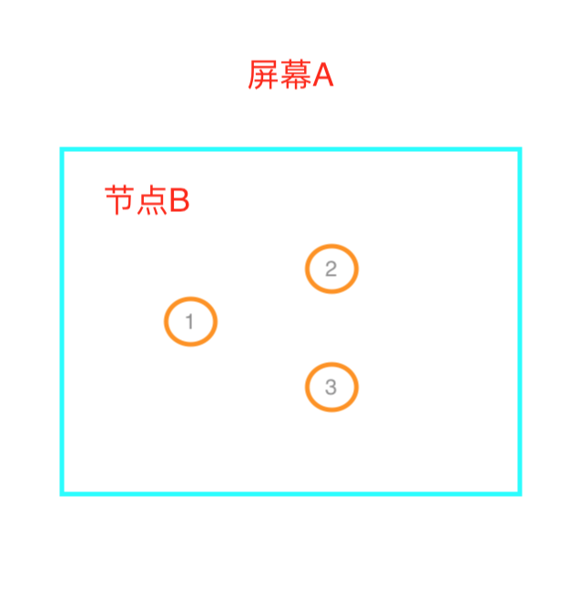

## 前言

本次给大家分享的是常见的移动端单点触摸事件的设计思路及实践。

## 核心技术

主要就是利用移动端的以下3个触摸事件，来模拟和实现自定义的手势操作

* touchstart：手指触摸到屏幕的一瞬间触发
* touchmove：手指在屏幕上移动时触发
* touchend：手指从屏幕上离开时触发

## 概念梳理

touch事件触发时，有3组数据可以获得触摸信息，可能大家会对这几组数据有些混淆，我根据自己的理解来尽量用通俗的语言给大家解释清楚

* touches：整个屏幕上所有的触摸点集合
* targetTouches：当前DOM元素上的所有触摸点集合
* changedTouches：相对上一次触摸点发生变化的集合

我们先来看一张图



如图所示，我们在节点B上绑定touch事件，圆圈代表触摸点。

此时节点B有3个触摸点，即`targetTouches`数组有3项，分别储存着触摸点的信息，此时`touches`和`targetTouches`是相同的。

当我们将手指3移出节点B（始终保持3个手指触摸在屏幕上），那么touchmove事件触发，`targetTouches`只剩2项，而`touches`依然有3项，此时`changedTouches`只有一项（因为只有手指3改变了）。

然后我们让所有手指离开屏幕，那么此时touchend事件触发，`touches`只剩0项，`targetTouches`剩0项，`changedTouches`有3项（因为3个手指发生了变化）。

好了，理解这些概念，有助于我们理解代码中何时改去哪个touch数组里面的值。

## 思路及实践

### tap

tap可以理解为点击事件，和click不同的是，移动端的click事件有大约300ms的延迟，这是因为浏览器要判断是否为双击事件。

**思路**

* touchstart：时记录时间点以及触摸点的x、y坐标
* touchend：计算此时与开始时的时间差，水平和垂直方向的偏移量

*说明：时间差用来判断用户触摸的时长，超过规定时间则tap事件无效；偏移量用来判断用户的触摸事件内是否有过移动的痕迹，这里我们允许少量的偏移，因为手指可能出现抖动的情况*

**实现**

```js
const tapDefaults = {
  time: 250,
  offset: 10
}

export default function tap (node, a, b) {
  let st, sx, sy
  let opts, callback

  if (typeof a === 'function') {
    callback = a
    opts = Object.assign({}, tapDefaults, b)
  } else {
    callback = b
    opts = Object.assign({}, tapDefaults, a)
  }

  node.addEventListener('touchstart', (e) => {
    e.preventDefault() // 组织浏览器默认行为，防止触摸过程页面滚动

    const touch = e.targetTouches[0]
    st = e.timeStamp
    sx = touch.pageX
    sy = touch.pageY
  }, false)

  node.addEventListener('touchend', (e) => {
    const touch = e.changedTouches[0]

    if (
      // 若为长按，则将时间判定条件更改
      e.timeStamp - st <= opts.time &&
      Math.abs(touch.pageX - sx) <= opts.offset &&
      Math.abs(touch.pageY - sy) <= opts.offset
    ) {
      callback && callback()
    }
  }, false)
}
```

### doubletap

即双击事件，两次点击时间间隔不超过规定时间则视为有效。

**思路**

* 第一次有效点击，记录该状态，反之重置状态
* 第二次有效点击，触发事件并重置状态
* 若两次时间间隔过长，重置状态

**实现**

```js
const tapDefaults = {
  time: 250,
  offset: 10
}

function handler (node, inject) {
  let st, sx, sy

  node.addEventListener('touchstart', (e) => {
    e.preventDefault()

    const touch = e.targetTouches[0]
    st = e.timeStamp
    sx = touch.pageX
    sy = touch.pageY
  }, false)

  node.addEventListener('touchend', (e) => {
    const touch = e.changedTouches[0]

    inject({
      time: e.timeStamp - st,
      offsetX: Math.abs(touch.pageX - sx),
      offsetY: Math.abs(touch.pageY - sy)
    })
  }, false)
}

export function doubletap (node, a, b) {
  let opts, callback
  let status = 0

  if (typeof a === 'function') {
    callback = a
    opts = Object.assign({}, tapDefaults, b)
  } else {
    callback = b
    opts = Object.assign({}, tapDefaults, a)
  }

  handler(node, (info) => {
    if (
      info.time <= opts.time &&
      info.offsetX <= opts.offset &&
      info.offsetY <= opts.offset
    ) {
      if (status === 0) {
        status = 1
        // 时间间隔太长则重置状态
        setTimeout(() => {
          status = 0
        }, opts.time)
      } else if (status === 1) {
        callback && callback()
        status = 0
      }
    } else {
      status = 0
    }
  })
}
```

### longtap

即长按，手指按住超过规定时间视为有效，在手指离开时触发。

**思路**

* 和tap事件思路一样，只不过时间的判定条件变更一下，改为超过多长时间才触发

**实现**

```js
const longtapDefaults = {
  time: 350,
  offset: 10
}

// 这里代码逻辑和tap事件一样
// 更改时间判定为：
// e.timeStamp - st > opts.time
```

### press

即按压事件，按住超过规定时间自动触发，注意和`longtap`不同的是，longtap需要等到手指离开时触发，而`press`在按压时间达到规定值，自动触发，此时手指还在屏幕上。

**思路**

* touchstart：记录此时的x、y坐标，并且开启一个定时器，在规定时间后执行回调，默认是350ms
* touchmove：监听移动过程，在事件触发前，若出现偏移量过大，则取消定时器
* touchend：取消定时器

分析：根据以上思路，若按压时间短，则手指离开时定时器已取消，回调不会触发。

**实现**

```js
const pressDefaults = {
  time: 350,
  offset: 10
}

export default function press (node, a, b) {
  let opts, callback, sx, sy
  let timer = null

  if (typeof a === 'function') {
    callback = a
    opts = Object.assign({}, pressDefaults, b)
  } else {
    callback = b
    opts = Object.assign({}, pressDefaults, a)
  }

  node.addEventListener('touchstart', (e) => {
    e.preventDefault()

    const touch = e.targetTouches[0]
    sx = touch.pageX
    sy = touch.pageY

    timer = setTimeout(() => {
      callback && callback()
    }, opts.time)
  }, false)

  node.addEventListener('touchmove', (e) => {
    const touch = e.targetTouches[0]

    if (
      Math.abs(touch.pageX - sx) > opts.offset ||
      Math.abs(touch.pageY - sy) > opts.offset
    ) {
      clearTimeout(timer)
    }
  }, false)

  node.addEventListener('touchend', () => {
    clearTimeout(timer)
  }, false)
}
```

### swipe

即手指滑动事件，应用场景如：轮播图左右滑动切换，整屏页面滑动翻页等，算是移动端最常见的手势之一了。

**思路**

* touchstart：记录时间点和触摸点位置
* touchmove：实时判断滑动偏移量
* touchend：计算滑动速度和方向，条件判定是否触发事件

分析：考虑到需要在滑动过程做一些动画特效等操作，因此我们将滑动中的事件暴露给用户自定义，值得注意的是，若是要实时改变滑块位置的话，最好不要截流或防抖，截流会造成滑动卡顿的现象，而防抖会出现延迟同步滑动操作的情况；另外对滑动速度也进行了处理，原则上用户滑动距离超过规定后即视为有效，然而为了更好的用户体验，我们判定，如果用户在短时间内滑动速度非常快的话，也视为一次有效的操作，不一定非要滑动很长的距离

**实现**

```js
const swipeDefaults = {
  direction: 'horizontal', // vertical
  speed: 200,
  offset: 100,
  prevent: true,
  // touchmove: (offset) => {}
}

export default function swipe (node, a, b) {
  let opts, callback, sTime, sTouch, eTouch

  if (typeof a === 'function') {
    callback = a
    opts = Object.assign({}, swipeDefaults, b)
  } else {
    callback = b
    opts = Object.assign({}, swipeDefaults, a)
  }

  node.addEventListener('touchstart', (e) => {
    if (opts.prevent) {
      e.preventDefault()
    }

    sTime = e.timeStamp
    sTouch = eTouch = e.targetTouches[0]
  }, false)

  if (typeof opts.touchmove === 'function') {
    node.addEventListener('touchmove', (e) => {
      eTouch = e.targetTouches[0]

      if (opts.direction === 'horizontal') {
        opts.touchmove(eTouch.pageX - sTouch.pageX)
      } else {
        opts.touchmove(eTouch.pageY - sTouch.pageY)
      }
    }, false)
  }

  node.addEventListener('touchend', (e) => {
    eTouch = e.changedTouches[0]

    let time = e.timeStamp - sTime
    let offset, direction

    if (opts.direction === 'horizontal') {
      offset = eTouch.pageX - sTouch.pageX
      direction = offset > 0 ? 'right' : 'left'
    } else {
      offset = eTouch.pageY - sTouch.pageY
      direction = offset > 0 ? 'down' : 'up'
    }

    if (
      Math.abs(offset) >= opts.offset ||
      Math.abs(offset) / time * 1000 >= opts.speed
    ) {
      callback && callback(direction)
    }
  }, false)
}
```

## 结束语

通过以上的思路讲解和代码实现，我们完成了一个单点触控的移动端手势库，是不是迫不及待的想要一睹为快、体验一番。

最后附上本次分享的源码和文档：[https://github.com/ansenhuang/axe/blob/master/packages/touch/README.md](https://github.com/ansenhuang/axe/blob/master/packages/touch/README.md)