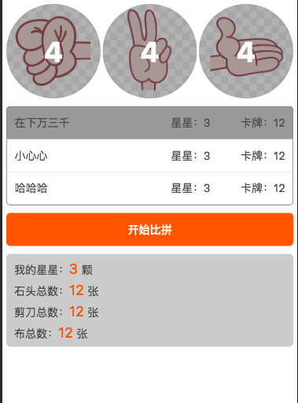

最近刷了一部电影《动物世界》，感概原来简单的“剪刀石头布”游戏还可以这么烧脑，强大的数据分析能力、对人性心理的灵敏嗅觉等。看完之后饶有兴致，于是便利用socket技术，实现了一个“动物世界”多人对战系统。

## 游戏背景


故事讲述的是男主被发小欺骗，欠下了一屁股债，为了偿还债务被迫上了一艘贼船，同时上船的还有一批人，大伙儿的状况都差不多。上船的好处是有机会还清债务并且还可能获得一笔巨大的财富，这对于在现实世界中已经生活不能自理的人来说，无疑是一次改变人生的机会，而一旦失败的话，就要被拉去做人体实验（恐怖如斯）。

上船的人会进行一场赌博，就是我们小时候常玩的“石头剪刀布”，每人初始时拥有12张卡牌，石头、剪刀、布各4张，并且拥有3颗星，大家可以找任何一个人作为对手，每人各出一张卡牌，获胜者将从失败方拿走一颗星。游戏获胜条件是手里卡牌全部消耗完并且拥有的星星不少于3颗，反之，若卡牌消耗完且星星少于3颗、或还有卡牌但星星为0，都视为失败。

## 后端逻辑

我们将利用`koa`来搭建一个socket服务器，来管理客户端的消息接受和分发。

主要逻辑：

```js
const io = SocketIO(server) // 建立socket连接
const users = {} // 缓存当前链接的用户
const challengeData = {} // 缓存用户发起的对战信息

io.on('connection', socket => { // 客户端连接后
  const id = socket.id // 当前连接的unique标识

  socket.emit('connected') // 告诉客户端已经连接成功

  // 接收客户端的open事件
  socket.on('open', name => {
    // 初始化数据
    users[id] = {
      id,
      name, // 用户昵称
      star: 3, // 用户拥有的星星
      stone: 4, // 用户拥有的“石头”卡牌数量
      scissors: 4, // 用户拥有的“剪刀”卡牌数量
      paper: 4 // 用户拥有的“布”卡牌数量
    }

    // 通知所有人，当前所有用户的信息
    io.emit('update_users', users)
  })

  // 用户发起挑战
  socket.on('challenge', data => {
    // data包括fromCard（发起者出示的卡牌）、toId（被挑战者的id）
    data.fromId = id
    challengeData[id] = data
    io.to(data.toId).emit('accept_challenge', users[id]) // 告诉对方有人要和你对战
  })

  // 发起者取消了挑战
  socket.on('cancel_challenge', () => {
    io.to(challengeData[id].toId).emit('cancel_challenge') // 告诉对方挑战已取消
    delete challengeData[id] // 删除缓存的数据
  })

  // 对方接受挑战的信息
  socket.on('respond_challenge', data => {
    if (data.accept) { // 接受
      let cd = challengeData[data.fromId]
      cd.toCard = data.toCard // 被挑战者出示的卡牌

	   // 双方卡牌各减少1
      users[cd.fromId][cd.fromCard]--
      users[cd.toId][cd.toCard]--

      let result = getChallengeResult(cd.fromCard, cd.toCard) // 获得挑战结果

	   // 比赛后的星星变更
      if (result === 1) {
        users[cd.fromId].star++
        users[cd.toId].star--
      } else if (result === -1) {
        users[cd.fromId].star--
        users[cd.toId].star++
      }

	   // 告诉挑战者和被挑战者，比赛的结果
      io.to(cd.fromId).emit('result_challenge', result, users)
      io.to(cd.toId).emit('result_challenge', -result, users)
    } else { // 拒绝
      io.to(data.fromId).emit('cancel_challenge') // 告诉发起者对方不接受挑战
    }

    delete challengeData[data.fromId]
  })

  // 比赛胜利
  socket.on('success_challenge', () => {
    // 告诉所有人，有人获得了胜利
    socket.broadcast.emit('success_challenge', users[id])
  })

  // 断开连接
  socket.on('disconnect', () => {
    delete users[id]
    // 广播用户已退出
    socket.broadcast.emit('update_users', users)
  })
})
```

## 前端逻辑

前端使用`Vue`来进行页面渲染。

```js
import request from '@/common/request'
import tips from '@axe/tips'
import modal from '@axe/modal'

import Loading from './components/Loading.vue'

/* eslint-disable no-alert */
export default {
  name: 'App',
  components: {
    Loading
  },
  data () {
    return {
      isConnected: false,
      id: '',
      selectedUserId: '',
      selectedCard: '',
      users: {},
      acceptChallenge: false
    };
  },
  computed: {
    userInfo () {
      let user = this.users[this.id] || {}

      return {
        star: user.star || 0,
        stone: user.stone || 0,
        scissors: user.scissors || 0,
        paper: user.paper || 0
      }
    },
    totalInfo () {
      let info = {
        stone: 0,
        scissors: 0,
        paper: 0
      }

      for (let id in this.users) {
        let user = this.users[id]

        info.stone += user.stone || 0
        info.scissors += user.scissors || 0
        info.paper += user.paper || 0
      }

      return info
    }
  },
  methods: {
    handleSelectCard (type) {
      this.selectedCard = type
    },
    handleSelectUser (id) {
      if (this.id === id) {
        tips.show({
          content: '不可以挑战自己哦'
        })
        return
      }

      this.selectedUserId = id
    },
    handleChallenge () {
      if (this.gameover) {
        tips.show({
          content: '游戏已结束，请重新开始'
        })
        return
      }

      if (!this.selectedCard) {
        tips.show({
          content: '请挑选卡牌'
        })
        return
      }

      if (this.users[this.id][this.selectedCard] <= 0) {
        tips.show({
          content: '这类卡牌已耗尽'
        })
        return
      }

      let user = this.users[this.selectedUserId]

      if (!user) {
        tips.show({
          content: '请挑选对手'
        })
        return
      }

      if (user.star <= 0 || (user.stone + user.scissors + user.paper) <= 0) {
        tips.show({
          content: '该用户已不具备对战能力了'
        })
        return
      }

      if (!this.acceptChallenge) {
        this.socket.emit('challenge', {
          fromCard: this.selectedCard,
          toId: this.selectedUserId
        })

        modal.show({
          title: '发起挑战',
          content: '等待对方接受中...',
          confirmText: '取消挑战'
        }, t => {
          if (t === 'confirm') {
            this.socket.emit('cancel_challenge')
          }
        })
      } else {
        this.socket.emit('respond_challenge', {
          accept: true,
          fromId: this.challengeFromUser.id,
          toCard: this.selectedCard
        })

        // 重置记录
        this.acceptChallenge = false
      }
    }
  },
  mounted () {
    request({
      url: '/api/info'
    }).then(data => {
      // 使用ip建立连接，局域网内其他设备也可以访问
      this.socket = window.io.connect('http://' + data.ip + ':' + data.port)

      this.socket.on('connected', () => {
        let name = window.prompt('请输入您优雅高贵的称呼')

        if (!name || !name.trim()) {
          name = this.socket.id
        }

		  // 告诉服务器，有人进来了
        this.socket.emit('open', name)

        // 已连接
        this.id = this.socket.id
        this.isConnected = true
      })

      this.socket.on('update_users', users => {
        this.users = users
      })

      // 是否接受挑战
      this.socket.on('accept_challenge', fromUser => {
        modal.show({
          title: '接受挑战',
          content: '是否接受来自【' + fromUser.name + '】的挑战？',
          confirmText: '接受',
          cancelText: '拒绝'
        }, t => {
          if (t === 'confirm') {
            // 缓存挑战信息，等待用户选择出示的卡牌
            this.selectedUserId = fromUser.id
            this.acceptChallenge = true
            this.challengeFromUser = fromUser
          } else {
            this.socket.emit('respond_challenge', {
              accept: false,
              fromId: fromUser.id
            })
          }
        })
      })

      this.socket.on('cancel_challenge', () => {
        this.acceptChallenge = false

        modal.hide()
        tips.show({
          content: '对方取消了挑战'
        })
      })

      // 监听对战结果
      this.socket.on('result_challenge', (result, users) => {
        this.users = users

        modal.hide()
        tips.show({
          content: result === 0 ? '平局' : (result === 1 ? '你赢了' : '你输了')
        }, () => {
          // 检测游戏胜利和失败条件
          let user = users[this.id]
          let cardCount = user.stone + user.scissors + user.paper

          if (user.star >= 3 && cardCount <= 0) {
            this.socket.emit('success_challenge')

            modal.show({
              title: '游戏胜利',
              content: '恭喜你获得了胜利！',
              confirmText: '再来一局'
            }, t => {
              if (t === 'confirm') {
                window.location.reload()
              }
            })
          } else if (user.star <= 0 || cardCount <= 0) {
            this.gameover = true

            modal.show({
              title: '游戏结束',
              content: user.star <= 0 ? '你已经没有星星了' : '你已经没有卡牌了',
              confirmText: '重新开始'
            }, t => {
              if (t === 'confirm') {
                window.location.reload()
              }
            })
          }
        })
      })

      // 接收系统广播，有人挑战成功的信息
      this.socket.on('success_challenge', user => {
        window.alert(`恭喜【${user.name}】挑战成功，战绩（${user.star}）颗星`)
      })
    })
  }
}
```

## 补充说明

游戏预览



源码地址：[https://github.com/ansenhuang/node-socket](https://github.com/ansenhuang/node-socket)
