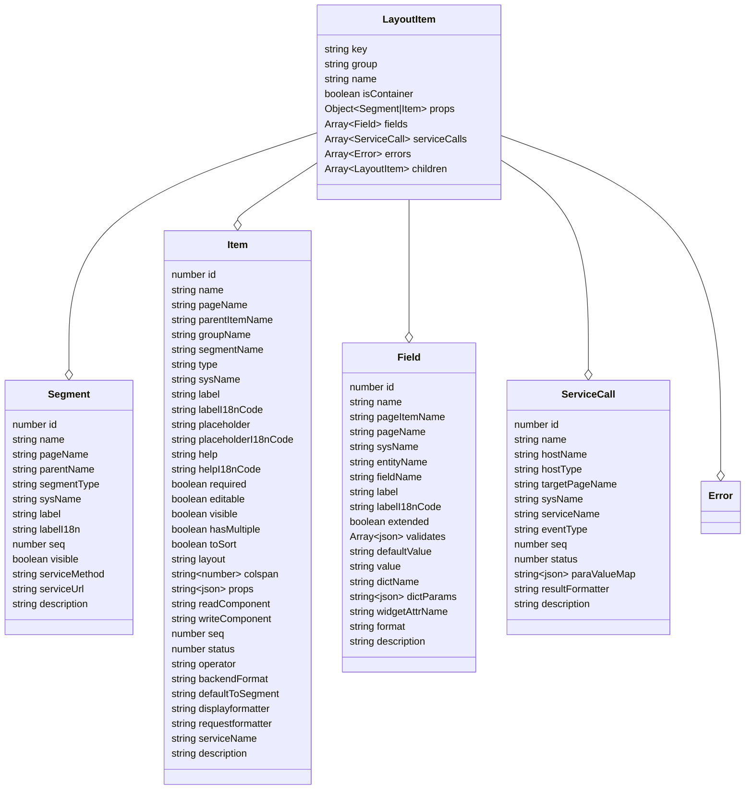

# MTM布局器数据结构

```mermaid
classDiagram
  class LayoutItem {
    string key
    string group
    string name
    boolean isContainer
    Object~Segment|Item~ props
    Array~Field~ fields
    Array~ServiceCall~ serviceCalls
    Array~Error~ errors
    Array~LayoutItem~ children
  }

  LayoutItem --o Segment
  LayoutItem --o Item
  LayoutItem --o Field
  LayoutItem --o ServiceCall
  LayoutItem --o Error
    
  class Segment {
    number id
    string name
    string pageName
    string parentName
    string segmentType
    string sysName

    string label
    string labelI18n
    number seq
    boolean visible
    string serviceMethod
    string serviceUrl
    string description
  }

  class Item {
    number id
    string name
    string pageName
    string parentItemName
    string groupName
    string segmentName
    string type
    string sysName

    string label
    string labelI18nCode
    string placeholder
    string placeholderI18nCode
    string help
    string helpI18nCode
    boolean required
    boolean editable
    boolean visible
    boolean hasMultiple
    boolean toSort
    string layout
    string~number~ colspan
    string~json~ props
    string readComponent
    string writeComponent
    number seq
    number status
    string operator
    string backendFormat
    string defaultToSegment
    string displayformatter
    string requestformatter
    string serviceName
    string description
  }

  class Field {
    number id
    string name
    string pageItemName
    string pageName
    string sysName

    string entityName
    string fieldName
    string label
    string labelI18nCode
    boolean extended
    Array~json~ validates
    string defaultValue
    string value
    string dictName
    string~json~ dictParams
    string widgetAttrName
    string format
    string description
  }

  class ServiceCall {
    number id
    string name
    string hostName
    string hostType
    string targetPageName
    string sysName
    
    string serviceName
    string eventType
    number seq
    number status
    string~json~ paraValueMap
    string resultFormatter
    string description
  }

  class Error {

  }
```